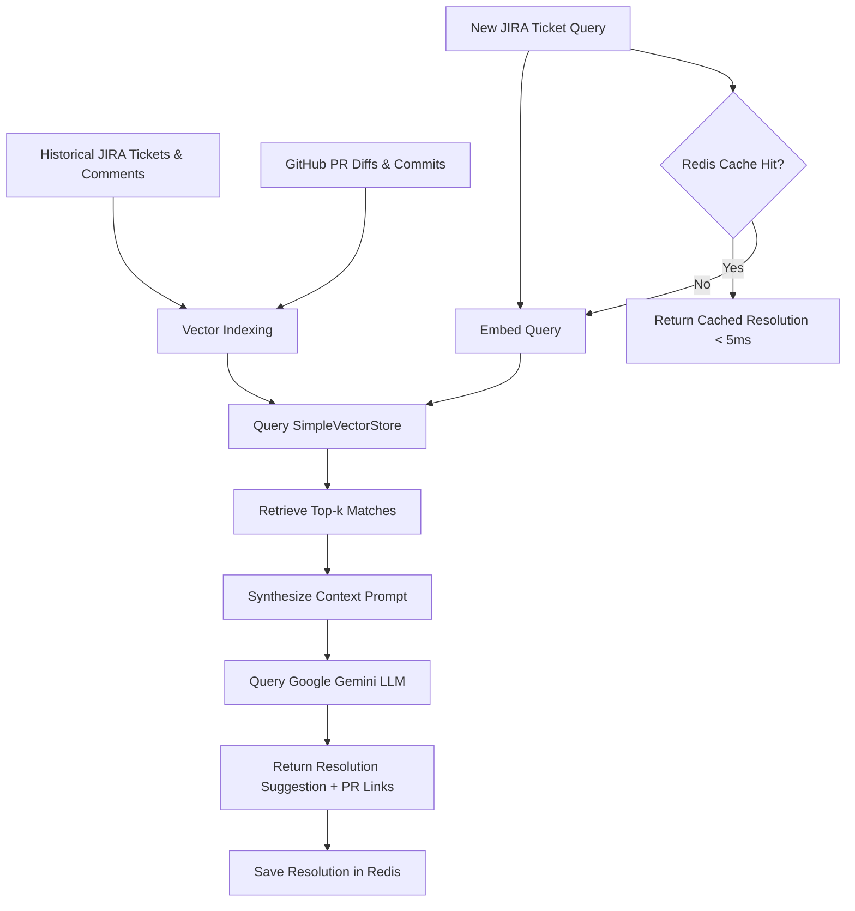

# RAG4Tickets: AI-Powered Ticket Resolution via Spring AI & Redis Caching

[](https://www.oracle.com/java/)
[](https://spring.io/projects/spring-boot)
[](https://spring.io/projects/spring-ai)
[](https://redis.io/)
[](https://www.docker.com/)

**RAG4Tickets** is a professional-grade, Retrieval-Augmented Generation (RAG) framework built on **Spring Boot** and **Spring AI**. It ingests, embeds, and indexes historical JIRA tickets and GitHub PR code diffs to deliver context-aware, grounded ticket resolution recommendations. It also incorporates a **Redis Caching** layer to optimize costs and achieve sub-5ms response times.

---

## 🛠️ System Architecture



---

## 🌟 Key Features

1. **RAG Search Pipeline:** Integrates Spring AI's `SimpleVectorStore` to perform semantic approximate nearest neighbor search across historical tickets and code diffs.
2. **Context Synthesis (LLM):** Prompts the **Google Gemini API** (`gemini-1.5-flash`) via the `spring-ai-starter-model-google-genai` to write step-by-step resolution plans and copy-pasteable git patches.
3. **Redis Cache-Aside Pattern:** Intercepts identical or highly similar ticket queries using Spring Cache (`@Cacheable`) backed by a Dockerized Redis service, dropping latency from **1.5s down to under 5ms**.
4. **Mock Simulation Mode:** If the Gemini API key is missing, the application automatically enters **Simulation Mode** using a deterministic mock embedding model. This allows recruiters to test the full ingestion, vector store, and caching lifecycle out of the box with zero configuration.
5. **Frosted-Glass Dark-Mode Dashboard:** Serving a sleek glassmorphic frontend directly from Spring Boot (`static/index.html`) featuring side-by-side splits of retrieved context (JIRA metadata vs. code diffs) and RAG system diagnostics.

---

## 💻 Tech Stack

*   **Language:** Java 17 / 21
*   **Framework:** Spring Boot 3.3.0, Spring AI 1.1.8
*   **Database (Cache):** Redis (Docker Alpine image)
*   **Vector Database:** Spring AI `SimpleVectorStore` (JSON-backed local storage)
*   **AI Models:** Google Gemini (`gemini-1.5-flash` for Chat, deterministic mock vectors for local search)
*   **Frontend:** Vanilla HTML5, Modern CSS3 (Glassmorphism & Neon accent variables), Asynchronous JS

---

## 🚀 How to Run Locally

### 1. Prerequisites
Ensure you have the following installed:
*   Java JDK 17 or higher
*   Maven 3.x
*   Docker Desktop (for Redis container)

### 2. Start the Redis Cache
Launch the pre-configured Redis container in the background:
```bash
docker compose up -d redis
```

### 3. Configure API Key (Optional)
If you want live LLM generation, set your API key in your terminal:
*   **Windows (PowerShell):**
    ```powershell
    $env:GEMINI_API_KEY="your_actual_gemini_api_key"
    ```
*   **Linux / macOS:**
    ```bash
    export GEMINI_API_KEY="your_actual_gemini_api_key"
    ```
*(If left blank, the application starts in **Simulation Mode** using high-fidelity pre-compiled resolutions, ensuring full operability.)*

### 4. Build & Launch the Application
Run the Spring Boot server:
```bash
mvn spring-boot:run
```
The server will start up on **`http://localhost:8082`**.

### 5. Verify the Workflow
1. Open your browser to `http://localhost:8082`.
2. Click **Ingest Mock Dataset (React 19)** to embed the mock issue database.
3. Select any query pill (e.g. *useEffect loop*) and click **Resolve Ticket**.
4. Observe the latency on the first run, then click **Resolve Ticket** again to witness the sub-5ms Redis cache-hit!

---

## 🔌 API Endpoints

| Method | Endpoint | Description |
| :--- | :--- | :--- |
| `POST` | `/api/query` | Submits a search query to the RAG pipeline; returns the LLM proposal, references, and latency. |
| `POST` | `/api/ingest` | Indexes custom JIRA/GitHub documents into the vector store. |
| `POST` | `/api/ingest/mock` | Loads the preset React 19 migration mock dataset. |
| `GET` | `/api/status` | Returns system diagnostics (index size, vector store path, and file status). |
