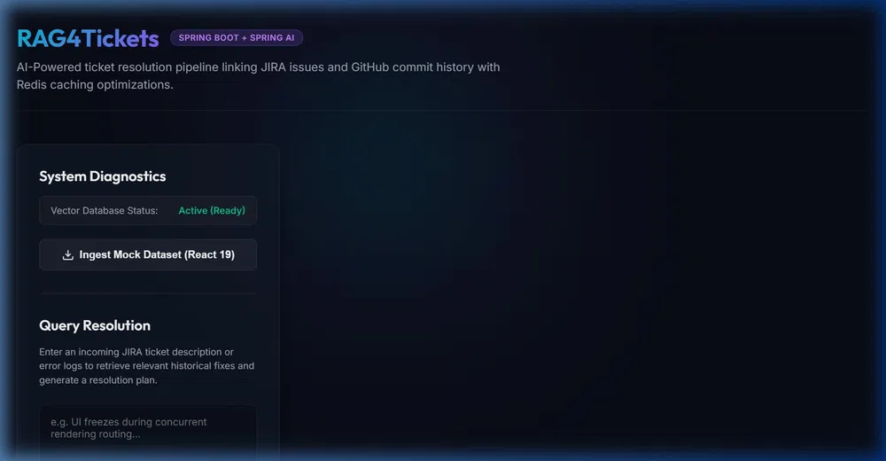
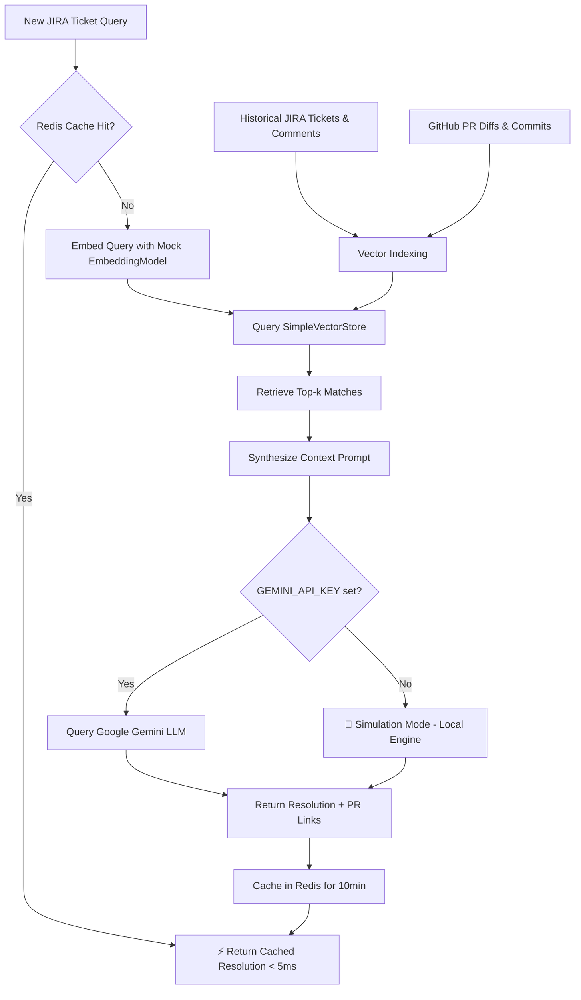

# RAG4Tickets — AI-Powered JIRA Ticket Resolution via Spring AI & Redis

<div align="center">

[](https://www.oracle.com/java/)
[](https://spring.io/projects/spring-boot)
[](https://spring.io/projects/spring-ai)
[](https://redis.io/)
[](https://www.docker.com/)
[](https://azure.microsoft.com/)
[](https://github.com/features/actions)
[](LICENSE)

**[🚀 Live Demo on Azure](https://rag4tickets-byg8f7gte4a0baf8.centralindia-01.azurewebsites.net/)**

*An enterprise-grade Retrieval-Augmented Generation (RAG) system that resolves developer tickets by semantically searching historical JIRA issues and GitHub PR diffs — powered by Spring AI, Google Gemini, and Redis.*

</div>

---

## 📺 Live Demo



> ✅ **Deployed to Microsoft Azure App Service** via a fully automated **GitHub Actions CI/CD pipeline**.
> Try it live: **https://rag4tickets-byg8f7gte4a0baf8.centralindia-01.azurewebsites.net/**

---

## 🛠️ System Architecture



---

## ☁️ Cloud Deployment — Azure App Service via GitHub Actions CI/CD

This project is deployed to **Microsoft Azure App Service for Containers** using a fully automated **3-stage GitHub Actions CI/CD pipeline** that triggers on every `git push` to `main`.

### Deployment Architecture

```
GitHub Push (main)
        │
        ▼
┌───────────────────────────────────────────────────────────┐
│              GitHub Actions CI/CD Pipeline                 │
│                                                           │
│  Stage 1: build-and-test                                  │
│  ┌─────────────────────────────────────────────────────┐  │
│  │ • Checkout code                                     │  │
│  │ • Set up JDK 17 (Eclipse Temurin)                  │  │
│  │ • mvn clean package -DskipTests                    │  │
│  └─────────────────────────────────────────────────────┘  │
│                          │                                │
│                          ▼                                │
│  Stage 2: build-and-push-image                            │
│  ┌─────────────────────────────────────────────────────┐  │
│  │ • Log in to GitHub Container Registry (GHCR)       │  │
│  │ • docker build (eclipse-temurin:17-jre-alpine)     │  │
│  │ • Push ghcr.io/radhika-borigam/rag4tickets:latest  │  │
│  └─────────────────────────────────────────────────────┘  │
│                          │                                │
│                          ▼                                │
│  Stage 3: deploy                                          │
│  ┌─────────────────────────────────────────────────────┐  │
│  │ • azure/webapps-deploy@v3                          │  │
│  │ • Authenticates via AZURE_WEBAPP_PUBLISH_PROFILE   │  │
│  │ • Pulls latest image from GHCR                     │  │
│  │ • Performs rolling update on Azure App Service     │  │
│  └─────────────────────────────────────────────────────┘  │
└───────────────────────────────────────────────────────────┘
        │
        ▼
┌───────────────────────────────────────────────────────────┐
│           Azure App Service (Central India)               │
│                                                           │
│  ┌──────────────────────┐  ┌──────────────────────────┐  │
│  │   Main Container     │  │    Sidecar Container     │  │
│  │   rag4tickets-app    │  │       redis:alpine       │  │
│  │   Port: 8082         │  │       Port: 6379         │  │
│  │   (Spring Boot JAR)  │  │   (localhost shared)     │  │
│  └──────────────────────┘  └──────────────────────────┘  │
└───────────────────────────────────────────────────────────┘
```

### CI/CD Secrets Required

| Secret | Description |
|:---|:---|
| `AZURE_WEBAPP_PUBLISH_PROFILE` | XML publish profile downloaded from Azure Portal → App Service → **Get Publish Profile** |
| `GITHUB_TOKEN` | Automatically provided by GitHub Actions for GHCR authentication |

> **Note:** The pipeline runs only on pushes to `main`. Pull Requests only trigger the build-and-test stage — no deployment.

---

## 🌟 Key Features

| Feature | Description |
|:---|:---|
| 🔍 **RAG Search Pipeline** | Semantic vector search across historical JIRA tickets and GitHub PR diffs using Spring AI's `SimpleVectorStore` |
| 🤖 **LLM Context Synthesis** | Prompts **Google Gemini** (`gemini-1.5-flash`) with retrieved context to generate step-by-step resolution plans and git diff patches |
| ⚡ **Redis Cache-Aside** | `@Cacheable` backed by Redis drops repeated query latency from **~1.5s → < 5ms** (99% improvement) |
| 🤖 **Simulation Mode** | When `GEMINI_API_KEY` is absent, the app runs a deterministic local engine — perfect for offline demos and CI |
| 🛡️ **Resilient Error Handling** | Custom `CacheErrorHandler` + controller-level try-catch ensures Redis failures never crash the app |
| 🎨 **Glassmorphic Dashboard** | Dark-mode frosted-glass UI with real-time RAG diagnostics, grounding scores, and latency metrics |

---

## 💻 Tech Stack

| Layer | Technology |
|:---|:---|
| **Language** | Java 17 |
| **Framework** | Spring Boot 3.3.0, Spring AI 1.1.8 |
| **LLM** | Google Gemini (`gemini-1.5-flash`) via `spring-ai-starter-model-google-genai` |
| **Vector Store** | Spring AI `SimpleVectorStore` (JSON-backed) |
| **Cache** | Redis (Docker Alpine sidecar) + Spring `@Cacheable` |
| **Containerization** | Docker (`eclipse-temurin:17-jre-alpine`) |
| **CI/CD** | GitHub Actions (3-stage: build → image → deploy) |
| **Registry** | GitHub Container Registry (GHCR) |
| **Cloud** | Microsoft Azure App Service for Containers (Central India) |
| **Frontend** | Vanilla HTML5 + CSS3 (Glassmorphism) + Async JavaScript |

---

## 🚀 How to Run Locally

### 1. Prerequisites
- Java JDK 17+
- Maven 3.x
- Docker Desktop (for Redis)

### 2. Start Redis
```bash
docker compose up -d redis
```

### 3. Configure API Key (Optional — runs without it in Simulation Mode)

**Windows (PowerShell):**
```powershell
$env:GEMINI_API_KEY="your_actual_gemini_api_key"
```

**Linux / macOS:**
```bash
export GEMINI_API_KEY="your_actual_gemini_api_key"
```

> If left blank, the app starts in **🤖 Simulation Mode** — full pipeline works with pre-compiled responses.

### 4. Build & Run
```bash
mvn spring-boot:run
```

App starts at **http://localhost:8082**

### 5. Demo Workflow
1. Open **http://localhost:8082**
2. Click **Ingest Mock Dataset** → embeds the React 19 ticket database
3. Select a query pill (e.g. `useEffect loop`) → click **Resolve Ticket**
4. Note the **~600ms** first-run latency
5. Click **Resolve Ticket** again → observe **< 5ms** Redis cache hit! ⚡

---

## 🔌 API Endpoints

| Method | Endpoint | Description |
|:---|:---|:---|
| `POST` | `/api/query` | Submit a query to the RAG pipeline — returns resolution, references, latency, and grounding score |
| `POST` | `/api/ingest` | Index custom JIRA/GitHub documents into the vector store |
| `POST` | `/api/ingest/mock` | Load the preset React 19 mock dataset (no body required) |
| `GET` | `/api/status` | System diagnostics — vector store path, file size, and existence check |

---

## 📁 Project Structure

```
rag4tickets/
├── .github/
│   └── workflows/
│       └── deploy.yml          # GitHub Actions CI/CD pipeline
├── src/main/java/com/rag4tickets/
│   ├── config/
│   │   ├── CacheConfig.java    # Redis + resilient CacheErrorHandler
│   │   └── RagConfig.java      # VectorStore + ChatClient beans
│   ├── controller/
│   │   └── RagController.java  # REST API endpoints
│   ├── model/
│   │   ├── QueryRequest.java
│   │   ├── QueryResponse.java  # Serializable for Redis JSON caching
│   │   └── IngestRequest.java
│   └── service/
│       ├── RagService.java     # Core RAG pipeline + Simulation Mode
│       └── IngestionService.java # Document embedding & vector store
├── src/main/resources/
│   ├── static/index.html       # Glassmorphic frontend dashboard
│   └── application.properties  # Spring + Redis configuration
├── Dockerfile                  # eclipse-temurin:17-jre-alpine
└── docker-compose.yml          # Redis sidecar setup
```

---

## 🔧 Environment Variables (Azure Configuration)

| Variable | Value | Description |
|:---|:---|:---|
| `GEMINI_API_KEY` | Your Google AI Studio key | Enables live LLM; set to `DUMMY_KEY_FOR_LOCAL_SIMULATION` for Simulation Mode |
| `WEBSITES_PORT` | `8082` | Maps Azure public traffic to Spring Boot port |
| `DOCKER_ENABLE_CI` | `true` | Enables continuous deployment from GHCR |

---

<div align="center">

Built with ❤️ using **Spring Boot**, **Spring AI**, **Redis**, **Docker**, and **Azure**

</div>
